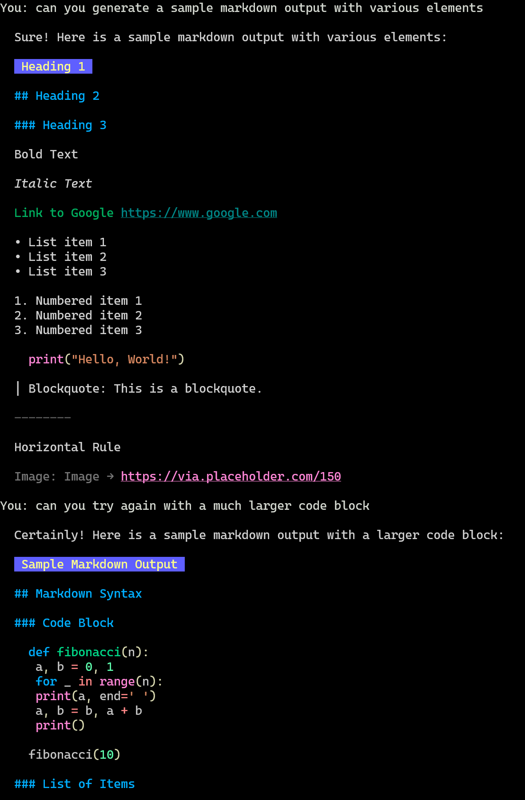

# ChatGPT CLI for Linux

**ChatGPT CLI for Linux** is a Bash shell script designed to interact with OpenAI's ChatGPT API directly from the Linux terminal. This lightweight and efficient CLI tool allows users to generate and render Markdown content using ChatGPT, with the added convenience of viewing the formatted output within the terminal. It's built for Linux users seeking a straightforward way to leverage ChatGPT without the need for a complex setup or a graphical interface.



## Features

- Generate Markdown content using ChatGPT
- Render Markdown beautifully in the terminal with `glow`
- Simple and easy-to-use CLI interface
- Contextual chat conversations
- No Python dependencies; purely Bash with minimal external tools

## Dependencies

- `curl`: Used to make requests to the OpenAI API.
- `jq`: Processes JSON data, including the responses from OpenAI's API.
- `glow`: Renders Markdown content in the terminal.

### Installation on Ubuntu/Debian

To install the required dependencies (`curl`, `jq`) and set up **ChatGPT CLI for Linux**, follow these steps:

1. **Install curl and jq**:
   Open a terminal and run the following command:
   ```bash
   sudo apt update && sudo apt install curl jq -y
   ```

2. **Install glow**:
   For the most up-to-date installation instructions for `glow`, please refer to the [Glow GitHub page](https://github.com/charmbracelet/glow). `glow` allows for the Markdown rendered by the script to be beautifully displayed in the terminal.

## Configuring OpenAI API Key

To use **ChatGPT CLI for Linux**, an OpenAI API key is required. Follow the steps below to create an account, add funds, and obtain your API key:

1. **Create an OpenAI Account**:
   - Visit [OpenAI's Signup Page](https://openai.com/signup/) and follow the instructions.

2. **Add Funds for API Use**:
   - API usage is not included with the standard ChatGPT subscription and requires pre-credited funds.
   - Log in to [OpenAI Platform](https://platform.openai.com/account/billing), navigate to Billing, and follow the instructions to add a payment method and credit your account.

3. **Generate an API Key**:
   - Go to [API Keys](https://platform.openai.com/account/api-keys) section in your OpenAI account and click "New API Key".
   - Securely store the generated API key for use with the CLI tool.

## Usage

After installing the dependencies and configuring your OpenAI API key, you can use the script to interact with ChatGPT from your terminal. Within the script, there are two variables you should be aware of:

1. **`API_KEY`**: Replace the placeholder value with your actual OpenAI API key to authenticate your requests. This key is crucial for accessing the ChatGPT API.

2. **`MODEL`** (optional): This variable defaults to `gpt-3.5-turbo`. Depending on your needs or the specific features you're looking for, you might want to use a different model. OpenAI offers a variety of models, including the newer `gpt-4` and `gpt-4-turbo`. Visit the [OpenAI Model Documentation](https://platform.openai.com/docs/models/gpt-4-and-gpt-4-turbo) for more information on available models and their capabilities. Adjust the `MODEL` variable in the script accordingly to use a different model.

To start the script and interact with ChatGPT, run:

```bash
./chatgpt-cli.sh
```

Ensure your API key is correctly set in the script or as an environment variable for secure access. Follow the prompts to input your queries and receive Markdown-formatted responses from ChatGPT. These responses are rendered directly in your terminal via `glow`, allowing you to view formatted text, code blocks, and other Markdown elements in a clean and readable format.

## Contributing

Contributions to **ChatGPT CLI for Linux** are welcome! If you have suggestions, improvements, or bug fixes, feel free to fork the repository, make your changes, and submit a pull request.

## MIT License

Copyright (c) 2024 Jonathan Geller

Permission is hereby granted, free of charge, to any person obtaining a copy
of this software and associated documentation files (the "Software"), to deal
in the Software without restriction, including without limitation the rights
to use, copy, modify, merge, publish, distribute, sublicense, and/or sell
copies of the Software, and to permit persons to whom the Software is
furnished to do so, subject to the following conditions:

The above copyright notice and this permission notice shall be included in all
copies or substantial portions of the Software.

THE SOFTWARE IS PROVIDED "AS IS", WITHOUT WARRANTY OF ANY KIND, EXPRESS OR
IMPLIED, INCLUDING BUT NOT LIMITED TO THE WARRANTIES OF MERCHANTABILITY,
FITNESS FOR A PARTICULAR PURPOSE AND NONINFRINGEMENT. IN NO EVENT SHALL THE
AUTHORS OR COPYRIGHT HOLDERS BE LIABLE FOR ANY CLAIM, DAMAGES OR OTHER
LIABILITY, WHETHER IN AN ACTION OF CONTRACT, TORT OR OTHERWISE, ARISING FROM,
OUT OF OR IN CONNECTION WITH THE SOFTWARE OR THE USE OR OTHER DEALINGS IN THE
SOFTWARE.

